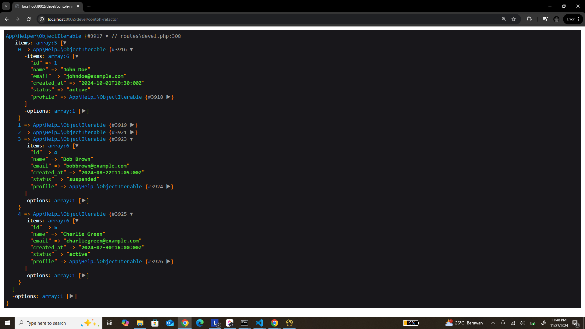

- Kode ini akan membantu kamu untuk mengabaikan case sensitive ketika mencoba akses array.
- Kode ini otomatis mengconvert array menjadi class (class disini bisa berperilaku seperti array, jadi kamu bisa akses seperti array pada umumnya)

  Berikut adalah dokumentasi untuk penggunaan class `ObjectIterable` yang mengonversi array ke objek dan mengabaikan case sensitivity saat mengakses array, serta mendeteksi jika suatu properti adalah array dan mengonversinya secara otomatis ke `RowData`.

### 1. **Pembuatan ObjectIterable**

Untuk membuat instance dari `ObjectIterable`, cukup masukkan array yang ingin dikonversi:

```php
$array = [
    'NAME' => 'John Doe',
    'email' => 'johndoe@example.com',
    'ADDRESS' => [
        'CITY' => 'New York',
        'ZIP' => '10001',
    ],
];

$objectIterable = new objectIterable($array);
```

### 2. **Akses Properti dengan Case Insensitive**

Setelah array dikonversi, Anda dapat mengakses nilai-nilai di dalamnya secara case-insensitive. Misalnya:

```php
echo $objectIterable->name; // Output: John Doe
echo $objectIterable->EMAIL; // Output: johndoe@example.com
```

### 3. **Akses Properti yang Merupakan Array**

Jika properti berisi array, properti tersebut secara otomatis akan dikonversi menjadi objek `RowData`:

```php
echo $objectIterable->address->city; // Output: New York
echo $objectIterable->ADDRESS->ZIP;  // Output: 10001
```

### 4. **Penggunaan dengan `foreach` (Iterator)**

Anda dapat melakukan iterasi melalui semua item dalam `ObjectIterable` atau `RowData` menggunakan `foreach`:

```php
foreach ($objectIterable as $item) {
    echo $item->name;
    echo $item->email;
}
```

Untuk array di dalam properti, iterasi akan bekerja sama:

```php
foreach ($objectIterable->address as $key => $value) {
    echo "$key: $value";
}
```

### 5. **Mengonversi Kembali ke Array**

Jika Anda ingin mengonversi objek kembali menjadi array, gunakan metode `toArray()`:

```php
$array = $objectIterable->toArray();
```

### 6. **Mengonversi ke Laravel Collection**

Jika Anda menggunakan Laravel dan ingin memanfaatkan Collection, gunakan metode `toCollect()`:

```php
$collection = $objectIterable->toCollect();
```

### 7. **Menggunakan JSON Serialize**

Anda dapat mengubah instance `ObjectIterable` ke JSON menggunakan `json_encode()`:

```php
$json = json_encode($objectIterable); // Menghasilkan JSON dari objek
```

### 8. **ArrayAccess (Akses seperti Array)**

`ObjectIterable` dan `RowData` juga mendukung akses seperti array:

```php
echo $objectIterable['name']; // Output: John Doe
```

Jika properti merupakan array, maka akan tetap bisa diakses seperti ini:

```php
echo $objectIterable['ADDRESS']['CITY']; // Output: New York
```

### 9. **Penghitungan Jumlah Item**

Anda dapat menggunakan `count()` untuk mengetahui jumlah elemen dalam `ObjectIterable`:

```php
echo count($objectIterable); // Output: jumlah elemen dalam array
```

### Contoh Kasus

```php
$data = [
    'Name' => 'Alice',
    'age' => 30,
    'Address' => [
        'Street' => '123 Main St',
        'City' => 'Wonderland',
    ]
];

$object = new objectIterable($data);

echo $object->name; // Alice
echo $object->address->city; // Wonderland

$arrayBack = $object->toArray();
``` 

Ini adalah cara pemakaian dasar dari class `ObjectIterable` yang Anda buat untuk mengonversi array ke objek dan memberikan akses yang lebih fleksibel dengan fitur case-insensitive serta otomatisasi dalam penanganan properti berjenis array.


## Lalu bagaimana untuk definisikan data object?
Mungkin jika kamu sudah terbiasa menggunakan TypeScript sudah tidak asing lagi dengan autocomplete yang membantu kamu mengetahui sebuah objek itu akan return property apa saja. Di TypeScrpt bisa mengggunakan tipe data custom dan interface.

Nah, dengan object iterable juga, berikut cara cara nya:

```
composer require rkwp/object-iterable-laravel
```

Setelah itu, daftarkan artisan command di project laravel kamu. Ada di file: `app/Console/Kernel.php`
Kemdian tambahkan ini:
```php
protected $commands = [
    \RKWP\Commands\GenerateDataTypeAndDataStructure::class
];
```

- Jalankan `php artisan make:data-type {NamaType} {property1,property2} {?isArrayOrNot}`

- Contoh: `php artisan make:data-type Users/User id,name,email,created_at,status,profile` atau `php artisan make:data-type Users/User id,name,email,created_at,status,profile`

- Setalah itu, maka akan terbuat file baru di `app/DataType/Users/TUser.php` yang berisi:
```php
<?php

namespace App\DataType\Devel\Users;

use App\DataStructure\Devel\Users\UserStruct;
use App\Helper\ObjectIterable;

class TUser extends ObjectIterable {
    use UserStruct;

    function __construct()
    {
        foreach (get_object_vars($this) as $name => $value) {
            unset($this->{$name});
        }
    }

    /**
     * @return self|ObjectIterable
     */
    public function set($items) {
        $this->assign($items, static::class);
        return $this;
    }
}
```

- Dan akan terbuat file struct di `app/DataStructure/Users/UserStruct.php` yang akanb berisi:
```php
<?php

namespace App\DataStructure\Devel\Users;

use App\DataType\Devel\Users\TProfile;

trait UserStruct {
	public $id;
	public $name;
	public $email;
	public $created_at;
	public $status;
	public TProfile $profile; // ini saya tambahkan sendiri secara manual, tapi class TProfile tetap saya buat menggunakan perintah artisan yang tadi
}
```

- Ada satu property tambahan yaitu `$profile` yang saya buat dan menyesuaikan property dari data array di bawah

## Hasil Final Cara Pakai Interface Object DataType
```php
    $users = [
        [
            'id' => 1,
            'name' => 'John Doe',
            'email' => 'johndoe@example.com',
            'created_at' => '2024-10-01T10:30:00Z',
            'status' => 'active',
            'profile' => [
                'age' => 30,
                'gender' => 'male',
                'location' => 'New York'
            ],
        ],
        [
            'id' => 2,
            'name' => 'Jane Smith',
            'email' => 'janesmith@example.com',
            'created_at' => '2024-09-15T08:45:00Z',
            'status' => 'inactive',
            'profile' => [
                'age' => 27,
                'gender' => 'female',
                'location' => 'Los Angeles'
            ],
        ],
        [
            'id' => 3,
            'name' => 'Alice Johnson',
            'email' => 'alicej@example.com',
            'created_at' => '2024-11-01T13:20:00Z',
            'status' => 'active',
            'profile' => [
                'age' => 35,
                'gender' => 'female',
                'location' => 'Chicago'
            ],
        ],
        [
            'id' => 4,
            'name' => 'Bob Brown',
            'email' => 'bobbrown@example.com',
            'created_at' => '2024-08-22T11:05:00Z',
            'status' => 'suspended',
            'profile' => [
                'age' => 40,
                'gender' => 'male',
                'location' => 'San Francisco'
            ],
        ],
        [
            'id' => 5,
            'name' => 'Charlie Green',
            'email' => 'charliegreen@example.com',
            'created_at' => '2024-07-30T16:00:00Z',
            'status' => 'active',
            'profile' => [
                'age' => 22,
                'gender' => 'non-binary',
                'location' => 'Seattle'
            ],
        ]
    ];

    $users = (new TUser())->set($users);

    dd($users->toArray()); // Untuk debug data

    $ageUsers = [];
    foreach ($users as $user) {
        array_push($ageUsers, $user->profile->age);
    }

    return implode(',', $ageUsers);
```

### Contoh Gambar

Perhatikan gambar diatas, ketika saya mengetikan `$user->nam` terlihat ada saran property nya, begitupun ketika saya coba akses property `$user->profile`. Karena profile sudah bisa diibaratkan memiliki tipe data yaitu `TProfile`

Makin penasaran apakah benar setiap datanya memiliki tipe data? yuk coba di dd

